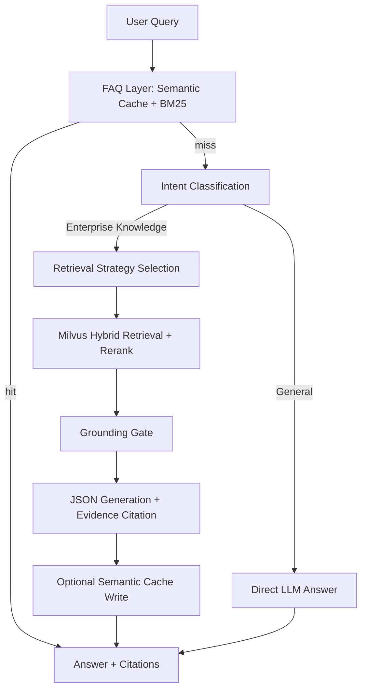

# Enterprise RAG System

[](https://github.com/tlnicky8-sudo/enterprise-rag-system/actions/workflows/ci.yml)
[](https://www.python.org/)
[](LICENSE)

Enterprise RAG System is a Chinese enterprise knowledge-base RAG template for internal policy, process, handbook, IT, HR, compliance, and operations Q&A. It combines a Redis FAQ fast path, Milvus hybrid retrieval, BGE-M3 embeddings, reranking, grounding checks, citations, configurable prompts, and OpenAI-compatible LLM APIs.


## Documentation

| Document | Description |
|----------|-------------|
| **[docs/data-and-cache-usage.md](docs/data-and-cache-usage.md)** | **Data ingestion, FAQ import, and cache policy** |
| [models/README.md](models/README.md) | Local model paths and intent classifier training |

## Features

- **Two-stage QA pipeline**: Redis FAQ fast path before Milvus-backed RAG fallback.
- **Grounded answers**: grounding gate, evidence citations, low-confidence refusal, and JSON output contract.
- **Adaptive retrieval strategies**: direct retrieval, HyDE, subquery retrieval, and backtracking retrieval with LLM selection plus heuristic fallback.
- **Document ingestion pipeline**: parse, clean, chunk, enrich, index, and lineage reporting.
- **FAQ and semantic cache**: JSONL FAQ import, Redis semantic cache, BM25 fallback, and optional RAG answer write-back.
- **Centralized configuration**: `config.ini` for infrastructure, `config/runtime.yaml` for runtime switches, and `config/prompts/` for prompt templates.

## Table of Contents

- [Documentation](#documentation)
- [Architecture](#architecture)
- [Quick Start](#quick-start)
- [Configuration](#configuration)
- [Data Ingestion](#data-ingestion)
- [Run](#run)
- [Evaluation](#evaluation)
- [Project Layout](#project-layout)
- [Contributing](#contributing)
- [License](#license)

## Architecture

The system follows a "FAQ fast path + trusted RAG fallback" architecture. Stable high-frequency questions are served from Redis first. Misses are routed through intent classification, retrieval strategy selection, hybrid retrieval, grounding, LLM generation, citation building, and optional semantic-cache write-back.



| Layer | Responsibility | Implementation |
|-------|----------------|----------------|
| FAQ Layer | Low-latency responses for stable high-frequency Q&A | Redis semantic cache + BM25 |
| Intent Layer | Route general questions and enterprise knowledge questions | BERT checkpoint / LLM fallback |
| Retrieval Layer | Select retrieval strategy based on query complexity | Direct / HyDE / Subquery / Backtracking |
| Trust Layer | Prevent unsupported answers and attach evidence | Grounding gate + citation builder |
| Cache Layer | Write high-quality RAG answers back to semantic cache | `core/cache_policy.py` |

**Data stores**

| Data | Storage | Import / Runtime Script |
|------|---------|-------------------------|
| Enterprise document chunks | Milvus | `setup_data.py` |
| FAQ pairs and semantic cache | Redis | `setup_faq_data.py` |
| Evaluation sets and reports | Local `data/assessment_data/` | `scripts/live_eval.py` |

For operational details, see [docs/data-and-cache-usage.md](docs/data-and-cache-usage.md).

## Quick Start

### Prerequisites

- Python 3.10 - 3.13
- [Milvus](https://milvus.io/) at `localhost:19530` by default
- Redis for FAQ search and semantic cache
- OpenAI-compatible LLM API key, such as DashScope, Qwen-compatible endpoints, or DeepSeek
- Local retrieval models: `bge-m3` and `bge-reranker-large`
- Optional local intent classifier checkpoint under `models/bert_outputs/`

### Install

```bash
git clone https://github.com/tlnicky8-sudo/enterprise-rag-system.git
cd enterprise-rag-system

uv venv && uv sync --extra retrieval --extra documents --extra faq --extra dev
# Alternative: pip install -r requirements.txt && pip install -r requirements-dev.txt
```

### Configure

```bash
cp config.example.ini config.ini
cp config/runtime.example.yaml config/runtime.yaml
cp .env.example .env
```

Fill in your API key in `.env`:

```bash
DASHSCOPE_API_KEY=your_api_key
DASHSCOPE_BASE_URL=https://dashscope.aliyuncs.com/compatible-mode/v1
```

Update local model paths in `config.ini`:

```ini
[models]
bge_m3_path = /path/to/bge-m3
bge_reranker_path = /path/to/bge-reranker-large
bert_base_path = /path/to/bert-base-chinese
bert_classifier_path = models/bert_outputs
```

### Ingest Data

```bash
# 1. Put enterprise documents under data/enterprise_data/
python setup_data.py

# 2. Prepare FAQ pairs and import them into Redis
mkdir -p data/faq_data
cp examples/faq_pairs.example.jsonl data/faq_data/faq_pairs.jsonl
python setup_faq_data.py
```

### Run

```bash
python web_app.py    # http://localhost:5000
python rag_main.py   # CLI
```

## Configuration

| File | Purpose |
|------|---------|
| `.env` | API keys and sensitive connection settings. Environment values take precedence over `config.ini`. |
| `config.ini` | Redis, Milvus, model paths, and ingestion chunk settings. |
| `config/runtime.yaml` | Feature flags, retrieval thresholds, grounding thresholds, strategy switches, and cache policy. |
| `config/prompts/*.txt` | Prompt templates for RAG, intent classification, HyDE, subquery, backtracking, and strategy selection. |

`config.ini` and `config/runtime.yaml` are local files and are not committed. Create them from the provided examples.

Intent classification loads `models/bert_outputs/best_intent_classifier.pt` first. If no local checkpoint exists, the system uses the LLM prompt at `config/prompts/intent.txt`; if the LLM fallback is unavailable, the default category is `专业咨询`.

Environment variable overrides:

```bash
RUNTIME_RETRIEVAL_RETRIEVAL_K=8
RUNTIME_GROUNDING_MIN_RERANK_SCORE=0.4
RUNTIME_CONFIG=/path/to/runtime.yaml
```

## Data Ingestion

For data-layer details, cache behavior, and threshold tuning, see [docs/data-and-cache-usage.md](docs/data-and-cache-usage.md).

### RAG Corpus Import — `setup_data.py`

Put PDF, Word, PowerPoint, Markdown, text, or image files under `data/enterprise_data/`, then run:

```bash
python setup_data.py
python setup_data.py --dry-run          # Validate parsing and chunking without writing to Milvus
python setup_data.py --enhance          # Add keywords and hypothetical questions to improve recall
python setup_data.py --skip-if-exists   # Skip ingestion when the Milvus collection already has data
```

### FAQ Import — `setup_faq_data.py`

FAQ pairs are stored as JSONL under `data/faq_data/faq_pairs.jsonl`, one record per line:

```json
{"question": "How many annual leave days do employees have?", "answer": "According to the employee handbook, employees with 1 to 10 years of cumulative work experience receive 5 days per year..."}
```

Import and preheat FAQ cache:

```bash
mkdir -p data/faq_data
cp examples/faq_pairs.example.jsonl data/faq_data/faq_pairs.jsonl
python setup_faq_data.py
python setup_faq_data.py --replace       # Clear existing FAQ records before import
python setup_faq_data.py --dry-run       # Validate input without writing to Redis
```

### Cache Policy

- **Read path**: semantic cache → BM25 → RAG fallback.
- **Write path**: high-quality grounded RAG answers can be written back to Redis.
- **Maintenance**: `python scripts/preheat_faq_cache.py` rebuilds semantic cache vectors from FAQ records.

## Run

| Entry | Command | Description |
|-------|---------|-------------|
| Web | `python web_app.py` | Flask chat UI with SSE streaming and citation metadata |
| CLI | `python rag_main.py` | Command-line Q&A |

Conversation history is stored in process memory and is cleared after restart.

## Evaluation

### Live Pipeline Evaluation

Runs the real `QAPipeline.answer()` flow, covering FAQ, Milvus retrieval, reranking, grounding, and LLM generation:

```bash
python scripts/live_eval.py
python scripts/live_eval.py --limit 3
python scripts/live_eval.py --fail-under-pass-rate 0.8
```

Golden set (local, not committed): `data/assessment_data/live_eval_golden.jsonl`  
Output directory: `data/assessment_data/live_eval_results/`

### RAGAS Offline Evaluation

```bash
python rag_evaluate.py
```

This uses static JSON data and does not invoke the live pipeline.

## Project Layout

```text
.
├── base/                         # Config, logging, prompt registry
├── config/
│   ├── prompts/                  # Prompt templates
│   └── runtime.example.yaml      # Runtime policy template
├── core/
│   ├── qa_pipeline.py            # FAQ + RAG orchestration
│   ├── rag_system.py             # Intent, retrieval strategy, generation, grounding
│   ├── vector_store.py           # Milvus + BGE-M3 + reranker
│   ├── faq/                      # Redis FAQ, BM25, semantic cache
│   └── ingest/                   # Parse, clean, chunk, enrich, index, lineage
├── data/
│   ├── enterprise_data/           # Local enterprise corpus, not committed
│   ├── faq_data/                  # Local FAQ pairs, not committed
│   └── assessment_data/           # Local evaluation data and reports
├── docs/
│   └── data-and-cache-usage.md    # Data ingestion and cache policy guide
├── examples/
│   └── faq_pairs.example.jsonl    # Minimal FAQ example
├── intent_classification/         # Optional BERT intent classifier training
├── text_splitter/                 # Chinese recursive text splitter
├── scripts/                       # Evaluation and data generation utilities
├── setup_data.py                  # RAG corpus ingestion entrypoint
├── setup_faq_data.py              # FAQ import entrypoint
├── web_app.py                     # Web entrypoint
└── tests/                         # Lightweight tests
```

## Tests

```bash
pytest
```

The lightweight test suite does not require Milvus, Redis, or an LLM API.

## Contributing

See [CONTRIBUTING.md](CONTRIBUTING.md). Before opening a pull request, run `pytest` and do not commit `.env`, `config.ini`, model weights, or local corpus data.

## License

[MIT](LICENSE)

## Publishing Checklist

Before publishing the repository, make sure the following are not committed:

- `.venv/`, `.idea/`, `.env`, `config.ini`, `config/runtime.yaml`
- `logs/`
- model weights under `models/`, including `models/bert_outputs/*.pt`
- local enterprise corpus and FAQ data under `data/`
- intent classifier training JSONL under `intent_classification/train_data/`
